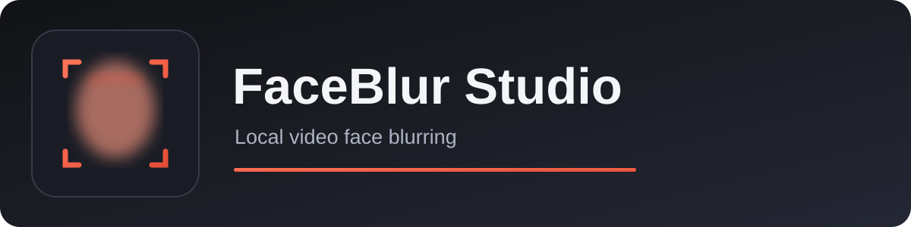
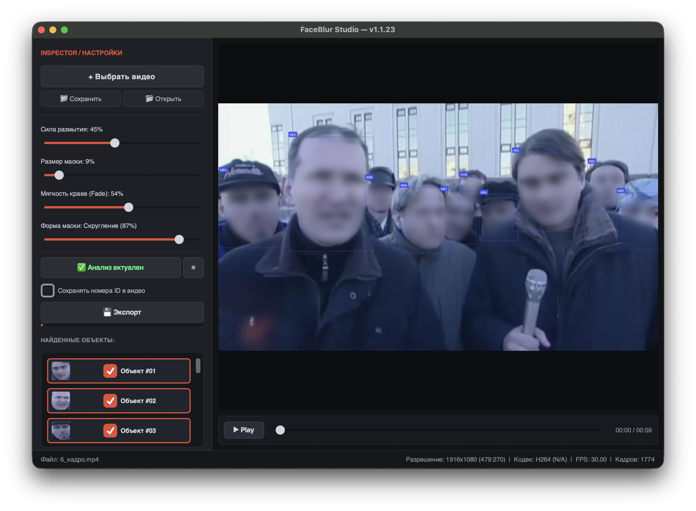

<p align="center"></p>

# FaceBlur Studio

<p align="center"></p>

<p align="center"><strong>Локальное размытие лиц в видео</strong><br>Предпросмотр, отслеживание лиц и выбор объектов для размытия.</p>

<p align="center"><strong>Русский</strong> · <a href="README.en.md">English</a></p>

> **Статус загрузки:** установщик пока не опубликован на GitHub. Раздел [Releases](https://github.com/sirdimitry/FaceBlur-Studio/releases) пуст. После проверки приложения здесь появится DMG для Mac с Apple Silicon. Windows-версия запланирована, но её установщика сейчас нет.

## Как выглядит приложение



## Возможности

- Автоматический поиск и отслеживание лиц с помощью YOLOv8-face.
- Выбор лиц, которые нужно размыть; предпросмотр результата и ручная настройка маски.
- Сохранение и открытие проекта `.fbp` с результатами анализа.
- Экспорт MP4 с исходной звуковой дорожкой, если она есть.
- Чтение кадров из видео по мере надобности, без хранения всего ролика в оперативной памяти.
- Локальная обработка: приложение не отправляет видео в облако.

Автоматическое распознавание может пропустить лицо. Перед публикацией проверьте всё экспортированное видео.

## Установка

**Готовый установщик.** Пока недоступен. Текущий код и локальный DMG 1.1.23 проверялись на Mac с Apple Silicon, но DMG ещё не опубликован как Release и не проходил проверку установки на другом чистом Mac. Нельзя гарантировать запуск без дополнительных действий на любом компьютере. Для обычного распространения macOS также нужны [подпись Apple Developer ID и нотариализация](https://developer.apple.com/documentation/technologyoverviews/distribution); без них Gatekeeper может заблокировать первый запуск.

**Запуск из исходного кода.** Нужны Python 3.12 и установленный FFmpeg. Модель `yolov8s-face.pt` уже находится в репозитории. На Mac можно установить FFmpeg через `brew install ffmpeg`.

```bash
git clone https://github.com/sirdimitry/FaceBlur-Studio.git
cd FaceBlur-Studio
python3 -m venv venv
source venv/bin/activate
python -m pip install -r requirements.txt
python main.py
```

Исходный код рассчитан в первую очередь на macOS; Windows-сборка и её установка пока не проверены. DMG из исходников собирается по инструкции в [скрипте сборки](scripts/build_macos_dmg.sh), но сборка сама по себе не заменяет проверку на чистом Mac.

## Диагностика

Лог при запуске из исходников: `debug_app.log` в папке проекта. Лог установленного Mac-приложения: `~/Library/Logs/FaceBlurStudio/debug_app.log`. Лог может содержать локальные пути к файлам; проверьте его перед публикацией.

## Состав репозитория

Здесь находятся исходный код, модель распознавания лиц, [иконка приложения](AutoBlureFace_icon.png), [баннер](assets/banner.svg) и актуальный скриншот. Установочный DMG в репозиторий не включён; после проверки он будет размещён в Releases. Размер локальной сборки составляет примерно 357 МБ.

## Лицензия

Отдельный файл лицензии в репозитории пока не опубликован. Условия повторного использования исходного кода и включённых моделей следует уточнить до распространения или переработки проекта.
