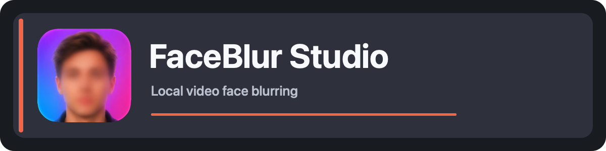

<p dir="ltr" align="center"><a href="README.md">English</a> · <a href="README.ru.md">Русский</a> · <a href="README.zh.md">简体中文</a> · <a href="README.ar.md">العربية</a> · <strong>Српски</strong> · <a href="README.el.md">Ελληνικά</a> · <a href="README.es.md">Español</a></p>

<!-- Generated by scripts/render_readmes.py. Update all language sources together. -->

<p align="center"></p>

# FaceBlur Studio

**Локално замућење лица у видеу**

Прегледајте видео, пратите лица и изаберите која желите да замутите. Видео остаје на вашем рачунару.

## Преузмите и испробајте

- [Windows 10/11 x64 — верзија 1.1.28 (EXE, 128 MiB)](https://github.com/sirdimitry/FaceBlur-Studio/releases/download/v1.1.28/FaceBlur-Studio-1.1.28-Windows-Setup.exe)
- [Mac са Apple Silicon — верзија 1.1.28 (DMG, 293 MiB)](https://github.com/sirdimitry/FaceBlur-Studio/releases/download/v1.1.28/FaceBlur_Studio_v1.1.28_Apple_Silicon.dmg)

Преузмите FaceBlur Studio и испробајте га на видеу. Биће нам драго да чујемо ваше утиске у одељку [Issues](https://github.com/sirdimitry/FaceBlur-Studio/issues). Ако вам је користан, подржите пројекат звездом [Star](https://github.com/sirdimitry/FaceBlur-Studio), направите [Fork](https://github.com/sirdimitry/FaceBlur-Studio/fork) или укључите [Watch](https://github.com/sirdimitry/FaceBlur-Studio) да пратите нове верзије. Хвала што помажете развоју пројекта.

> Оба инсталатора верзије 1.1.28 садрже свих седам језика интерфејса, препознавање језика система и арапски радни простор здесна налево. Windows издање исправља и покретање ONNX Runtime за GPU откривање лица преко DirectML; рад GPU-а је потврђен на рачунару са RTX 3070 Ti на коме се грешка јављала.

## Изглед апликације


## Могућности

- Аутоматско препознавање и праћење лица уз YOLOv8-face.
- Убрзање преко Apple Metal на macOS-у или DirectML на Windows-у, уз CPU као резерву.
- Изаберите лица за замућење и подесите величину и облик маске, јачину замућења и мекоћу ивица.
- Брз преглед и прецизан избор лица у зумираном видеу.
- Чување и поновно отварање `.fbp` пројеката са анализом и избором лица.
- Извоз у MP4 са изворним звуком, ако постоји.
- Читање кадрова по потреби, без чувања целог декодираног видеа у меморији.
- Локална обрада без слања видеа у облак.
- Седам језика интерфејса, аутоматско препознавање језика система и арапски радни простор здесна налево.

Аутоматско препознавање може пропустити лица. Проверите цео извезени видео пре објављивања.

## Инсталација

**Windows 10/11 x64:** покрените инсталатор и изаберите енглески, руски, поједностављени кинески, арапски, српски (ћирилица), грчки или шпански. Подразумевана локација је `%LOCALAPPDATA%\Programs\FaceBlur Studio`; инсталација је за тренутног корисника и не захтева администраторска права. Python, FFmpeg, модел и библиотеке су укључени. Деинсталирајте преко Windows подешавања; пројекти и подешавања корисника се чувају.

Windows инсталатор није дигитално потписан. Инсталација, поновна инсталација, покретање и уклањање проверени су на развојном Windows 11 рачунару; чист Windows или посебна VM још нису тестирани. Погледајте [детаље инсталатора](docs/WINDOWS_INSTALLER.md) и [резултате провере](docs/WINDOWS_VALIDATION.md).

Windows SHA-256: `9e4b347dd52b9d6d2eaefbf91596ec29895e393e0af6280a0440826d3280fdbb`

**Mac са Apple Silicon:** отворите DMG и превуците **FaceBlur Studio** у **Applications**. Python, FFmpeg и модел су укључени и не захтевају посебну инсталацију.

Овај прелиминарни DMG има локални потпис и **није оверен код Apple-а**. macOS може блокирати прво покретање. Ако верујете преузетом фајлу, пратите [Apple упутство за отварање](https://support.apple.com/en-au/102445) у системским подешавањима приватности и безбедности. Посебан чист Mac није тестиран. Ова слика је за Apple Silicon, не за Intel Mac или Windows.

macOS SHA-256: `9ba0cc0fd5c9dfba8a58c90ba0f4e16e2f4460efcc725131505016deb547ed1d`

### Покретање из изворног кода

Потребни су Python 3.12 и FFmpeg. Модели `yolov8s-face.pt` за macOS и `yolov8s-face.onnx` за Windows су укључени. На macOS-у инсталирајте FFmpeg командом `brew install ffmpeg`, затим покрените:

```bash
git clone https://github.com/sirdimitry/FaceBlur-Studio.git
cd FaceBlur-Studio
python3 -m venv venv
source venv/bin/activate
python -m pip install -r requirements.txt
python main.py
```

На Windows-у користите PowerShell, Python 3.12 и FFmpeg у PATH-у. Активирајте окружење са `.\venv\Scripts\Activate.ps1` и инсталирајте `requirements-windows.txt` уместо `requirements.txt`. Погледајте [Windows водич](docs/WINDOWS_HANDOFF.md) и [израду инсталатора](docs/WINDOWS_INSTALLER.md). За [DMG скрипту](scripts/build_macos_dmg.sh) потребан је `create-dmg`.

## Први кораци

1. Отворите видео и кликните **Пронађи лица**.
2. Изаберите лица у галерији, подесите маску и проверите преглед.
3. Сачувајте `.fbp` пројекат за касније или извезите MP4.

## Језици интерфејса

При првом покретању ажурирана апликација бира подржани језик из системских поставки; ако га нема, користи енглески. У **Подешавања → Језик интерфејса** изаберите **Аутоматски — језик система** или одређени језик. Избор се чува и важи одмах без затварања пројекта. Доступни су енглески, руски, поједностављени кинески, арапски, српски (ћирилица), грчки и шпански.

Арапски користи текст здесна налево и огледални распоред панела и радњи. Видео, координате лица, имена датотека, бројеви и временска линија задржавају изворно значење и смер.

## Дијагностика

Локације дневника:

- Изворни код: `debug_app.log`
- Инсталирана macOS апликација: `~/Library/Logs/FaceBlurStudio/debug_app.log`
- Инсталирана Windows апликација: `%LOCALAPPDATA%\FaceBlurStudio\Logs\debug_app.log`

Отворите фасциклу преко **О програму → Отвори фасциклу дневника**. Дневници могу садржати локалне путање; прегледајте их пре дељења.

## Садржај репозиторијума

Репозиторијум садржи код, моделе, [икону](AutoBlureFace_icon.png), [банер](assets/banner.png) и снимак екрана. Инсталатори су приложени уз [Windows v1.1.28](https://github.com/sirdimitry/FaceBlur-Studio/releases/tag/v1.1.28) и [macOS v1.1.28](https://github.com/sirdimitry/FaceBlur-Studio/releases/tag/v1.1.28), а не уз изворни код.

## Подршка и доприноси

Пријавите грешке, поделите утиске или предложите побољшања преко [GitHub Issues](https://github.com/sirdimitry/FaceBlur-Studio/issues). Наведите верзију, ОС, кораке и очекивани резултат. Приложите прегледан дневник ако треба, али не објављујте приватне видео-снимке. Исправке превода су добродошле.

Пројекат одржава [@sirdimitry](https://github.com/sirdimitry). За допринос прво отворите issue са описом, па пошаљите pull request са објашњењем и резултатима провере. Када мењате README, ажурирајте све језике; погледајте [поступак локализације](docs/LOCALIZATION.md).

## Лиценца

Посебан фајл лиценце још није објављен. Услове поновне употребе кода и укључених модела треба разјаснити пре дистрибуције или измена.
